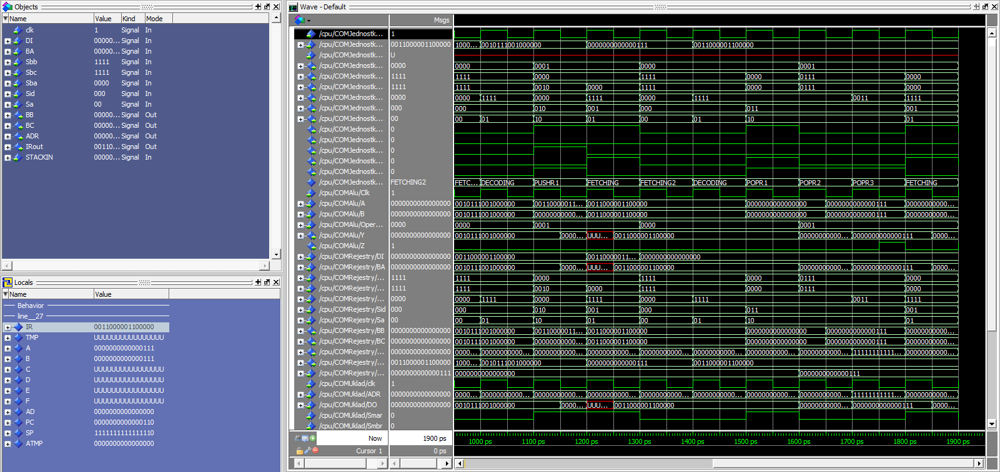

# FPGA_UC

## Lista możliwych rozkazów

```
+MOV R,R  
111	0001	R(4), R(4) 			| 15bit

+MOV R,ST5 	
100	0001	R(4),				| 11bit 
S(5)							| 5bit

+ADD R, R 
111	0010	R(4), R(4) 			| 15bit

+ADD R, ST5  
100	0010	R(4)				| 11bit 
S(5)							| 5bit

+SUB R, R 
111	0011	R(4), R(4) 			| 15bit

+SUB R, ST5 
100	0011	R(4)				| 11bit 
S(5)							| 5bit

+BR S
010	0100						| 7bit
S(8)							| 8bit

+ROL R, ST3 
100	0101	R(4),				| 11bit
S(3) 							| 3bit
 
+ROR R, ST3  
100	0110	R(4)				| 11bit
S(3) 							| 3bit

+ROL R, A 
101	0101						| 7bit
A(16) 							| 16bit
 
+ROR R, A  
101	0110						| 7bit
A(16) 							| 16bit

+PUSH R  
001	0111	R(4)				| 11bit

+POP R
001	1000	R(4) 				| 11bit

----------------------------> MAX 16(4*4)

```

